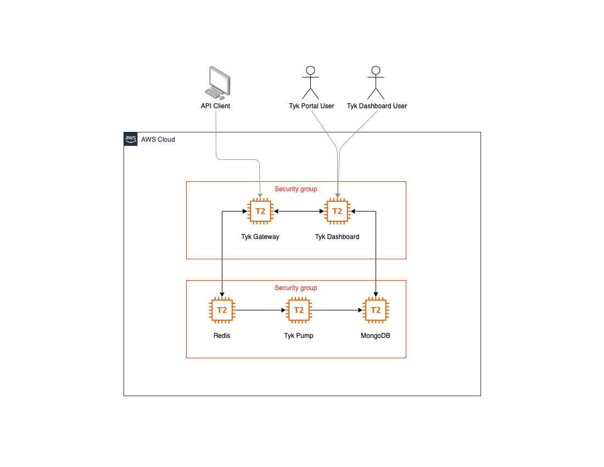

# Tyk on AWS
This repo provides a starting point for users to deploy Tyk on AWS. The single CloudFormation YAML file deploys the entire Tyk stack with a path towards production deployment in mind. 

This repo deploys the following components:

| AWS Resource  | Tyk Stack Component | Security Group |
|---------------|---------------------|----------------| 
| EC2 Instance  | Redis Database      | DatabaseSG     |
| EC2 Instance  | MongoDB Database    | DatabaseSG     |
| EC2 Instance  | Tyk Dashboard       | ApplicationSG  |
| EC2 Instance  | Tyk Pump            | DatabaseSG     |
| EC2 Instance  | Tyk Gateway         | ApplicationSG  |

# Operating System
Each EC2 Instance is using AmazonLinux2. 

# AWS Architecture Diagram

