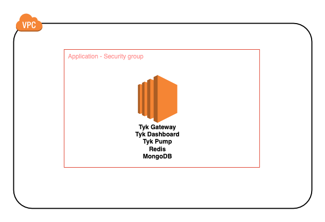
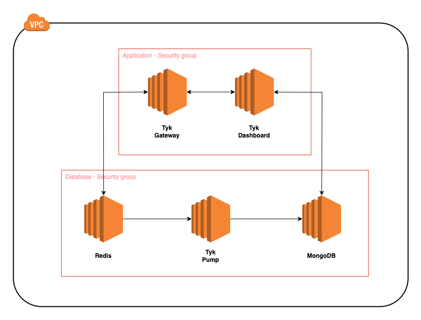

# Deploy Tyk on AWS
This repo provides a starting point to quickly deploy one of various types of Tyk archiectures on AWS. 
Each CloudFormation (.yaml) file deploys a type of architecture.
Under the `/deployments` directory, select the architecture relevant to your use-case. 

NOTE:FOR AMAZONLINUX2 ONLY

# Architectures

## Development
This architecture deploys all Tyk components and databases onto a single EC2 instance. 
This is ideal for testing and development. 
 
[CloudFormation Template](https://github.com/jonathanbernal25/aws-tyk/blob/main/deployments/dev.yaml)

 

## Single Gateway
This architecture deloys each component onto it's own EC2 instance. 
This is closer to the best practice of deploying Tyk to a production environment. 
 
NOTE: No high availability of any component.
 
[CloudFormation Template](https://github.com/jonathanbernal25/aws-tyk/blob/main/deployments/singlegateway.yaml)

 

## Multi Gateway
TBD...

